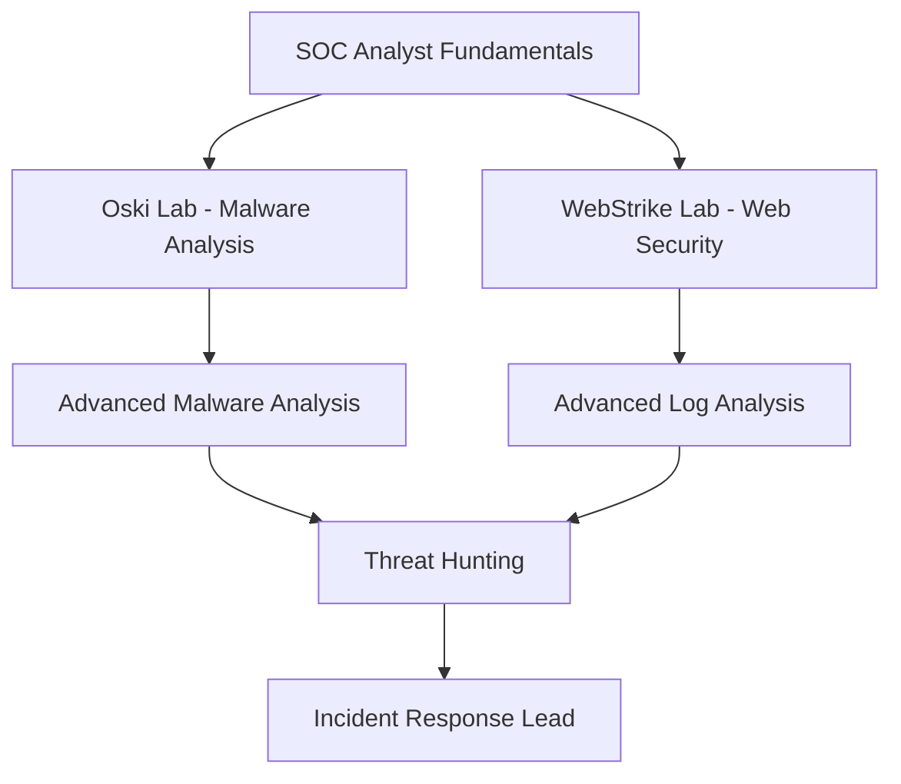

# Cyberdefenders-writeups
# 🛡️ CyberDefenders Blue Team Labs - Writeups Collection

## Overview

Welcome to my collection of **CyberDefenders Blue Team** writeups! This repository contains detailed analysis and solutions for various SOC analyst challenges, focusing on defensive cybersecurity techniques, threat hunting, and incident response.

**CyberDefenders** is a premier platform for blue team training, offering hands-on labs that simulate real-world security incidents. These writeups demonstrate practical skills essential for SOC analysts, threat hunters, and cybersecurity defenders.

## Skills Relevance for Corporate Intelligence

These SOC challenges directly apply to **KPMG Forensic Intelligence** work:

**Lespion Lab** demonstrates:
- ✅ **OSINT investigation** for insider threat detection
- ✅ **Username enumeration** across platforms (Sherlock)
- ✅ **Social media intelligence** (Instagram, GitHub profiling)
- ✅ **Geolocation techniques** (identifying locations from images)
- ✅ **Image analysis** (reverse search, metadata)

**Oski Lab** demonstrates:
- ✅ **Malware analysis** using threat intelligence platforms
- ✅ **Sandbox analysis** (Any.run behavioral analysis)
- ✅ **C2 server identification** (network IOCs)
- ✅ **MITRE ATT&CK** framework application
- ✅ **Timeline reconstruction** of security incidents

**Applications**:
- Due diligence investigations (background checks)
- Corporate fraud detection (insider threats)
- Threat intelligence gathering
- Incident response support
---

## Learning Objectives

Through these labs, you'll develop expertise in:

* **Malware Analysis** - Static and dynamic analysis techniques
* **Threat Intelligence** - OSINT and IOC investigation
* **Digital Forensics** - Evidence collection and timeline reconstruction  
* **Network Security** - Traffic analysis and intrusion detection
* **Incident Response** - Threat containment and remediation
* **MITRE ATT&CK** - Framework application for threat classification

---

## Writeups Collection

### 🔵 SOC Analyst Tier 1 Labs

| Lab Name | Difficulty | Category | Skills | Status | Writeup |
|----------|------------|----------|---------|---------|---------|
| **[Oski](https://cyberdefenders.org/blueteam-ctf-challenges/oski/)** |  | Malware Analysis | Hash Analysis, Sandbox, MITRE ATT&CK | ✅ Complete |[📖 View](./Oski/README.md) |
| **[WebStrike](./webstrike-lab/)** |  | Web Security | Log Analysis, Attack Reconstruction | ✅ Complete | [📖 View](./webstrike-lab/README.md) |
| **[Lespion](Lespion/REAME.md)** |  | Threat Intelligence | OSINT | ✅ Complete | [📖 View](Lespion/REAME.md) |

### Statistics

- **Total Labs:** 2
- **Completed:** 2 
- **Success Rate:** 100%
- **Categories Covered:** Malware Analysis, Web Security
- **Skills Developed:** 8+ core competencies

---

## Tools & Technologies

### Primary Analysis Tools
| Category | Tools Used |
|----------|------------|
| **Threat Intelligence** | VirusTotal, AbuseIPDB, MISP |
| **Malware Analysis** | Any.run, Cuckoo Sandbox, IDA |
| **Network Analysis** | Wireshark, NetworkMiner, Zeek |
| **Log Analysis** | Splunk, ELK Stack, grep/awk |
| **Forensics** | Volatility, Autopsy, FTK Imager |

### Frameworks & Methodologies
- **MITRE ATT&CK Framework** - Threat actor technique mapping
- **Cyber Kill Chain** - Attack phase identification
- **NIST Incident Response** - Structured response methodology
- **OWASP** - Web application security guidelines

---

## Lab Descriptions

### Oski Lab - Malware Analysis Fundamentals
**Scenario:** Investigation of malicious PowerPoint file that triggered SIEM alerts

**Key Learning Points:**
- Hash-based threat intelligence lookup
- Dynamic malware analysis in sandbox environments
- C2 server identification and network IOCs
- MITRE ATT&CK technique classification
- Malware evasion and persistence mechanisms

**Skills Developed:** Static/Dynamic Analysis, Threat Intel, Behavioral Analysis

---

### WebStrike Lab - Web Attack Investigation  
**Scenario:** Analysis of web application attack patterns and log forensics

**Key Learning Points:**
- Web server log analysis techniques
- Attack vector identification and classification  
- Timeline reconstruction from log evidence
- Web application vulnerability assessment
- Incident response documentation

**Skills Developed:** Log Analysis, Web Security, Forensic Timeline, DFIR

---

## Learning Path Progression

---

## Career Relevance

These labs directly prepare you for:

### Entry-Level Positions
- **SOC Analyst Tier 1** - Alert triage and initial investigation
- **Cybersecurity Analyst** - Threat detection and analysis
- **Incident Response Analyst** - Security incident handling

### Advanced Roles  
- **Threat Hunter** - Proactive threat discovery
- **Malware Analyst** - Specialized reverse engineering
- **Digital Forensics Investigator** - Evidence analysis
- **SOC Manager** - Team leadership and strategy

---

## Usage Guidelines

### For Students
1. **Read the scenario** carefully before starting analysis
2. **Follow the methodology** step-by-step  
3. **Document your findings** thoroughly
4. **Understand the 'why'** behind each technique
5. **Practice with similar tools** in your environment

### For Instructors
- Writeups include **detailed explanations** for teaching
- **Tool commands** provided for hands-on demonstration
- **Real-world context** connects theory to practice
- **Assessment questions** available for evaluation

---

## Additional Resources

### Official Platforms
- [CyberDefenders Platform](https://cyberdefenders.org/)
- [MITRE ATT&CK Framework](https://attack.mitre.org/)
- [NIST Cybersecurity Framework](https://www.nist.gov/cyberframework)

### Community Resources
- [Blue Team Labs Online](https://blueteamlabs.online/)
- [SANS FOR508 Resources](https://www.sans.org/cyber-security-courses/advanced-incident-response-threat-hunting-training/)
- [Awesome Incident Response](https://github.com/meirwah/awesome-incident-response)

---

## Contributing

Found an issue or have suggestions? Feel free to:

- **Report bugs** or errors in analysis
- **Suggest improvements** to methodology
- **Share alternative approaches** to problems
- **Add supplementary resources** or tools

---

## ⚠️ Disclaimer

> **Educational Use Only**
> 
> These writeups are created for educational purposes to help develop cybersecurity skills. All analysis is conducted on retired/public labs with proper authorization.
> 
> **Always follow responsible disclosure practices and your organization's security policies.**

---

*Last Updated: January 2026*  
*Next Lab: TBD - Advanced Forensics Challenge*
